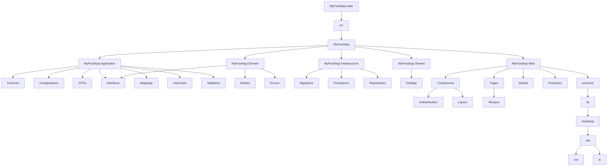
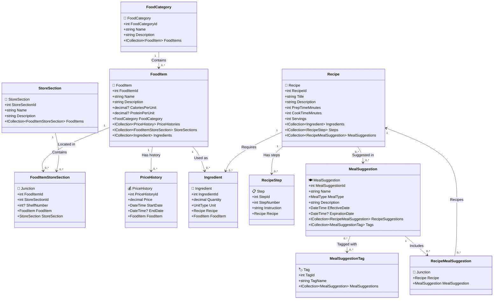

# MyFoodApp 🍔

## Features ✨
- 🍔 **Food Management**: Track ingredients and recipes, and food information.
- 🛒 **Grocery Integration**: Sync with store sections, store lookup along with price checker.
- 🤖 **Meal Recommendations**: Get meal suggestions, based on existing ingredients.

## Tech Stack 🛠️
- **Frontend**: Blazor 🌀
- **Backend**: .NET 9 🟣
- **Database**: Entity Framework Core 🗃️
- **Testing**: XUnit 🧪, Bogus 🎭, Shouldly ✅
- **Mapping**: AutoMapper 🧩
- **Validation**: FluentValidation 🛡️

## Project Directory Structure
[Auto Generated Directory](https://github.com/DavidMcKay223/MyFoodApp/tree/main/other/MyFoodApp.GeneratedReports#readme)

## Project Directory Structure Diagram

## Class Diagram

