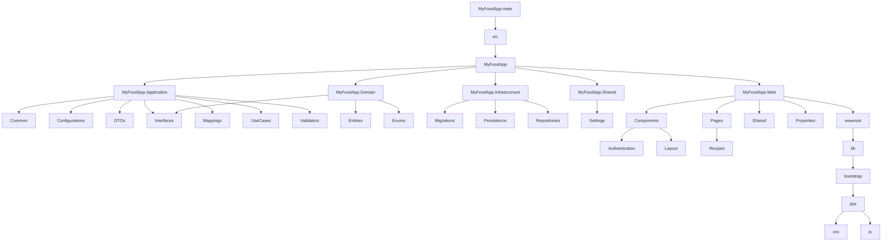

# MyFoodApp 🍔

[](https://opensource.org/licenses/MIT)
[](https://github.com/DavidMcKay223/MyFoodApp/actions)

## Features ✨
- 🍔 **Food Management**: Track ingredients and recipes.
- 🛒 **Grocery Integration**: Sync with store sections.
- 🤖 **AI Recommendations**: Get meal suggestions.

## Tech Stack 🛠️
- **Frontend**: Blazor 🌀
- **Backend**: .NET 9 🟣
- **Database**: Entity Framework Core 🗃️
- **Testing**: XUnit 🧪, Bogus 🎭, FluentAssertions ✅
- **Mapping**: AutoMapper 🧩
- **Validation**: FluentValidation 🛡️

## Project Directory Structure
[Auto Generated Directory](https://github.com/DavidMcKay223/MyFoodApp/tree/main/other/MyFoodApp.GeneratedReports#readme)

## Class Diagram


## SQL Analytics

### 1. Average Cost per Recipe
```SQL
SELECT 
  r.RecipeId,
  r.Title,
  ROUND(SUM(ph.Price * i.Quantity), 2) AS TotalCost,
  r.Servings,
  ROUND(SUM(ph.Price * i.Quantity)/r.Servings, 2) AS CostPerServing
FROM [MyFoodApp].[dbo].[Recipes] r
JOIN [MyFoodApp].[dbo].[Ingredients] i ON r.RecipeId = i.RecipeId
JOIN (
  SELECT FoodItemId, Price
  FROM [MyFoodApp].[dbo].[PriceHistories]
  WHERE EndDate IS NULL OR EndDate >= GETDATE()
) ph ON i.FoodItemId = ph.FoodItemId
GROUP BY r.RecipeId, r.Title, r.Servings
```

### 2. Popular Meal Suggestion Tags
```SQL
SELECT TOP 10
  t.TagName,
  COUNT(*) AS TagCount
FROM [MyFoodApp].[dbo].[MealSuggestionTagMapping] m
JOIN [MyFoodApp].[dbo].[MealSuggestionTags] t ON m.TagId = t.TagId
GROUP BY t.TagName
ORDER BY TagCount DESC
```

### 3. Current Price Trends by Category
```SQL
SELECT 
  fc.Name AS Category,
  AVG(ph.Price) AS AvgPrice
FROM [MyFoodApp].[dbo].[FoodItems] fi
JOIN [MyFoodApp].[dbo].[PriceHistories] ph ON fi.FoodItemId = ph.FoodItemId
JOIN [MyFoodApp].[dbo].[FoodCategories] fc ON fi.FoodCategoryId = fc.FoodCategoryId
WHERE ph.EndDate >= GETDATE() OR ph.EndDate IS NULL
GROUP BY fc.Name
```

### 4. Recipes by Preparation Time
```SQL
SELECT 
  CASE 
    WHEN (PrepTimeMinutes + CookTimeMinutes) <= 30 THEN 'Quick'
    WHEN (PrepTimeMinutes + CookTimeMinutes) <= 60 THEN 'Moderate'
    ELSE 'Lengthy'
  END AS TimeCategory,
  COUNT(*) AS RecipeCount
FROM [MyFoodApp].[dbo].[Recipes]
GROUP BY 
  CASE 
    WHEN (PrepTimeMinutes + CookTimeMinutes) <= 30 THEN 'Quick'
    WHEN (PrepTimeMinutes + CookTimeMinutes) <= 60 THEN 'Moderate'
    ELSE 'Lengthy'
  END
```

### 5. Store Section Inventory
```SQL
SELECT 
  ss.Name AS StoreSection,
  COUNT(*) AS ItemCount
FROM [MyFoodApp].[dbo].[FoodItemStoreSections] fiss
JOIN [MyFoodApp].[dbo].[StoreSections] ss ON fiss.StoreSectionId = ss.StoreSectionId
GROUP BY ss.Name
```

### 6. High-Protein Recipes
```SQL
SELECT TOP 10
  r.Title,
  SUM(fi.ProteinPerUnit * i.Quantity) AS TotalProtein
FROM [MyFoodApp].[dbo].[Recipes] r
JOIN [MyFoodApp].[dbo].[Ingredients] i ON r.RecipeId = i.RecipeId
JOIN [MyFoodApp].[dbo].[FoodItems] fi ON i.FoodItemId = fi.FoodItemId
GROUP BY r.Title
HAVING SUM(fi.ProteinPerUnit * i.Quantity) > 30
```

### 7. Meal Suggestions Analysis
```SQL
SELECT 
  MealType,
  COUNT(*) AS SuggestionCount,
  AVG(DATEDIFF(DAY, EffectiveDate, ExpirationDate)) AS AvgDurationDays
FROM [MyFoodApp].[dbo].[MealSuggestions]
GROUP BY MealType
```

### 8. Price Fluctuation Analysis
```SQL
SELECT 
  fi.Name AS FoodItem,
  MAX(ph.Price) - MIN(ph.Price) AS PriceFluctuation,
  (MAX(ph.Price) - MIN(ph.Price))/MIN(ph.Price) * 100 AS PercentChange
FROM [MyFoodApp].[dbo].[PriceHistories] ph
JOIN [MyFoodApp].[dbo].[FoodItems] fi ON ph.FoodItemId = fi.FoodItemId
GROUP BY fi.Name
HAVING MAX(ph.Price) - MIN(ph.Price) > 2
```

### 9. Expiring Meal Suggestions
```SQL
SELECT 
  Name,
  Description,
  ExpirationDate
FROM [MyFoodApp].[dbo].[MealSuggestions]
WHERE ExpirationDate BETWEEN GETDATE() AND DATEADD(DAY, 7, GETDATE())
```

### 10. Most Used Ingredients
```SQL
SELECT TOP 15
  fi.Name AS Ingredient,
  COUNT(DISTINCT r.RecipeId) AS RecipeCount
FROM [MyFoodApp].[dbo].[Ingredients] i
JOIN [MyFoodApp].[dbo].[FoodItems] fi ON i.FoodItemId = fi.FoodItemId
JOIN [MyFoodApp].[dbo].[Recipes] r ON i.RecipeId = r.RecipeId
GROUP BY fi.Name
```

## Project Folder Structure Diagram

